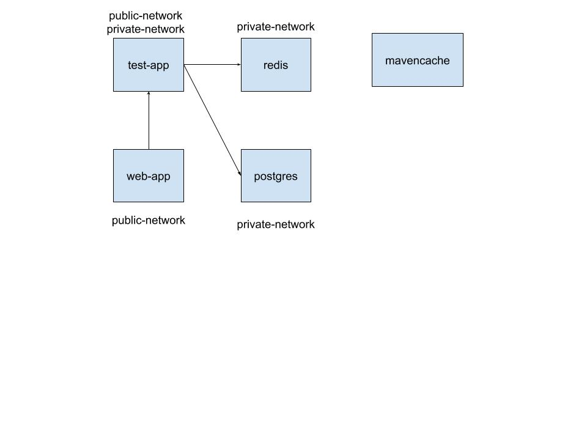

### docker compose trainning

#### base image

mavencache is a base image for build application images.run ``` ./ops/publish.sh``` to publis maven cache to docker hub.

#### Network topo



#### run project

run ``` docker-compose up ``` to run application.

#### visit test app

http://localhost:8091/book  to create a book

#### visit web app

http://localhost:8080/api/books  list all books having created

#### connect redis 

Web app will send a message when application run.


